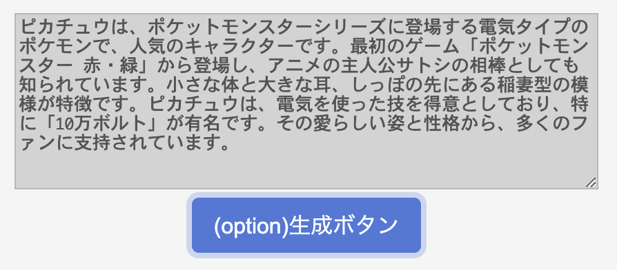

# samplesディレクトリにあるサンプルプログラムの動かし方
PokeAPIの呼び出しと、表示されているポケモンの説明をchat-gptで生成するサンプルです。
- UI: htmlファイル
- サーバー: server_sample.py
- api呼び出しモジュール: openai_sample.py

### 注意
- pythonバージョンは3.7以上を想定しています
- 動作確認はmacのターミナルで行っています
- この先の操作はカレントディレクトリがlecture-prototypingであることを想定しています


## 準備
### 仮想環境の作成と依存関係のインストール


```
python -m venv venv
```

```
source venv/bin/activate
```

```
pip install -r api/samples/requirements.txt
```


### アクセスキーの設定
アクセスキーを取得していない場合は、openaiのページから登録し、キーを取得してください。
https://platform.openai.com/

#### [Option1] .envの場合
`.env`ファイルをカレントディレクトリ下に作成し、ファイルの中身を以下のように入力しておく ※実際のアクセスキーを入力してください

```
OPENAI_API_KEY=access_key
```

`openai_sample.py`ファイルの5行目のコメントアウトを外し、6行目をコメントアウトする
```
api_key = os.getenv("OPEN_API_KEY")
# api_key = ""
```

#### [Option2] ファイルにベタ書きする場合
※アクセスキーの漏洩に注意してください

`openai_sample.py`ファイルの5行目をコメントアウトし、6行目のコメントアウトを外す ※実際のアクセスキーを入力してください
```
# api_key = os.getenv("OPEN_API_KEY")
api_key = "access_key"
```


## 実行
### ①サーバーを実行する
```
python api/samples/server_sample.py
```

### ②UIを実行する
`api/samples/pokeapi_sample_complete.html`をchromeで開く


### ③適当な番号を入力し、GETボタンをクリックする

### ④(option)生成ボタンをクリックする
表示されているポケモンに関する説明をchat-gptが返してくれ、表示される
